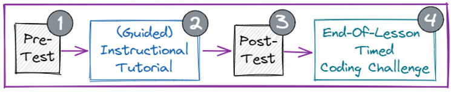

# Research Project

Learning to create a visual novel using Sprite Lab on Code.org

This page will contain the links to the Pre-and Post-Tests for each lesson. The videos for each lesson and challenge will be made available at the end of each lesson.

The links to the Pre-and Post-Test will be made available at the start of each day and then the links will no longer work after the lesson.

> Each lesson's challenge video will be available after it has been presented in the classroom.

## Lesson 1

In this lesson you will learn about **variables**, how to use a **prompt** block to ask a question, and how to have a character say the text typed in.

- [x] Pre-Test
- [x] Post-Test

- [Sprite Lab - Lesson 1 Tutorial (complete)](https://studio.code.org/projects/spritelab/RnoUpcvWz5P61wwiSE6zifnlrklaAVF3TQ4w7x9T-0g)
- [Sprite Lab - Lesson 1 Challenge (complete)](https://studio.code.org/projects/spritelab/M92bSuCazsBeuqMEeXbS34G12lG12ChNmrwZSw0YL4Q)

- [x] [Lesson 1 Videos](https://www.youtube.com/watch?v=tOw0pPCpZzI&list=PLyCwPGjh8kDzNSHZnwvwYUVpqtIAmDtRq)

## Lesson 2

In lesson 2, you will learn how to use events to change backgrounds using buttons. You learn how to keep count

- [ ] Pre-Test <!-- [Pre-Test](https://docs.google.com/forms/d/e/1FAIpQLSd7jefnro7MCVc4fACqgEK_HfS7tYNeIIgknAiiBSuVrP8Ygg/viewform?usp=share_link) -->
- [ ] Post-Test <!-- [Post-Test](https://docs.google.com/forms/d/e/1FAIpQLSezTXFnMepsgzASb8noEJLXm9dVyv3FGyOy-YvLgw27fNlOCA/viewform?usp=share_link) -->
- [ ] Lesson 2 Videos <!-- [Lesson 2 Videos](https://www.youtube.com/watch?v=s6cOdjzLfGY&list=PLyCwPGjh8kDzFuT1NtSF9BzClOxf2oUmd) -->

#### Video Lesson Tutorials (Lesson 2)

1. [Project Tutorial Overview](https://www.youtube.com/watch?v=s6cOdjzLfGY)
2. [Creating the Scene and Making Custom Costumes](https://www.youtube.com/watch?v=SAYqDQyL8hk)
3. [Events Blocks and the Change Block](https://www.youtube.com/watch?v=VWAGlFRRRZk)
4. [IF Blocks and Backgrounds](https://www.youtube.com/watch?v=UZ07BGof-so)
5. [Logical Operators and Limiting The Count](https://www.youtube.com/watch?v=naYjb5rzoAk)

## Lesson 3

- [ ] Pre-Test <!-- [Pre-Test](https://docs.google.com/forms/d/e/1FAIpQLSdGdX1UVTqyYL9-RxFZAPTH4IMCQT8I_2lSJCi4YCfBt-4bKg/viewform?usp=share_link) -->
- [ ] Post-Test <!-- [Post-Test](https://docs.google.com/forms/d/e/1FAIpQLSfS864OE8afnw_cGRrNPs_5XKt-z0FJ1pILo2_ROyOgOA8XCQ/viewform?usp=share_link) -->
- [ ] Lesson 3 Videos <!-- [Lesson 3 Videos](https://www.youtube.com/watch?v=oS4WiaM-AuI&list=PLyCwPGjh8kDx_bRz2j8xGrWUNWKsuNHVf) -->

#### Video Lesson Tutorials (Lesson 3)

1. [Lesson Overview](https://www.youtube.com/watch?v=oS4WiaM-AuI)
2. [Scene 1 Design](https://www.youtube.com/watch?v=a3Kd2wCmpLY)
3. [Scene 1 Function](https://www.youtube.com/watch?v=MMtju6AyW1M)
4. [Nested Functions](https://www.youtube.com/watch?v=qe65Nin43ig)
5. [Named Sprites](https://www.youtube.com/watch?v=qaD2k9cC6UM)
6. [Scene Game Over](https://www.youtube.com/watch?v=LldZGxpd4yk)
7. [Scene 3](https://www.youtube.com/watch?v=k5TMO6dbInY)
8. [Yes and No Events](https://www.youtube.com/watch?v=R9QQfd5UTlY)

## Lesson 4

- [ ] Pre-Test <!-- [Pre-Test]() -->
- [ ] Post-Test <!-- [Post-Test]() -->
- [ ] Lesson 4 Videos <!-- [Lesson 4 Videos](https://www.youtube.com/watch?v=oS4WiaM-AuI&list=PLyCwPGjh8kDx_bRz2j8xGrWUNWKsuNHVf) -->

#### Video Lesson Tutorials (Lesson 4)

1. 
