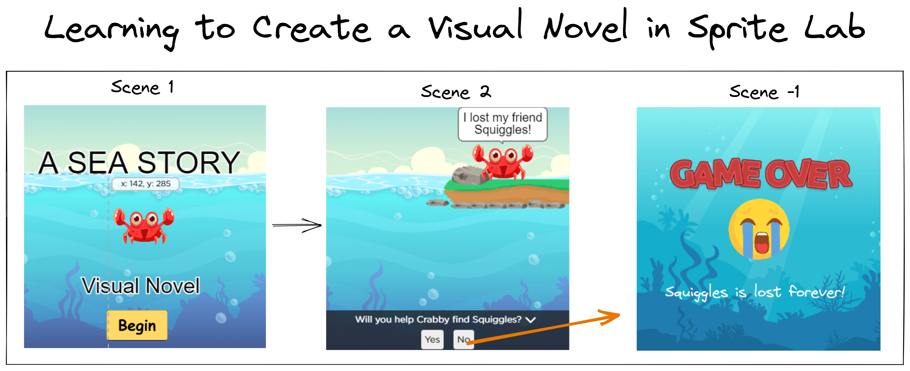
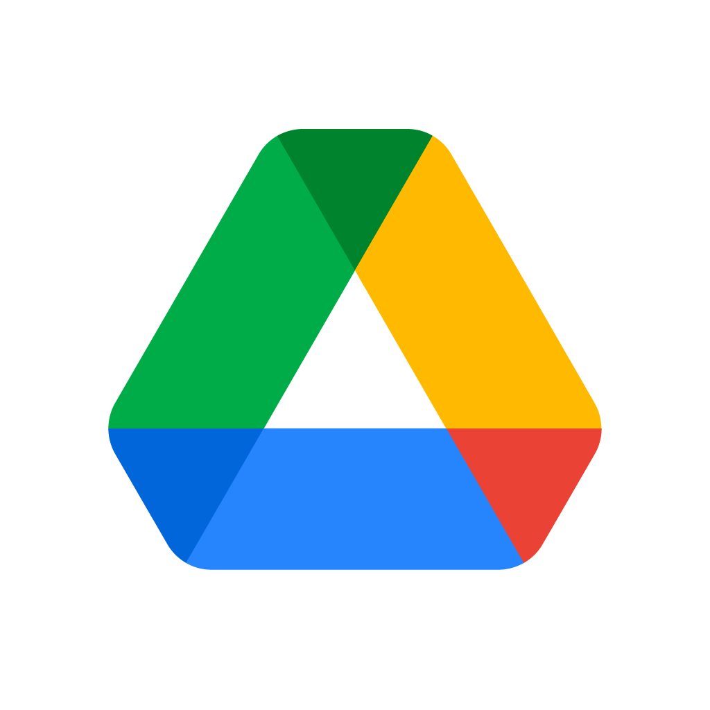

# Research Project

Learning to create a visual novel using Sprite Lab on Code.org

This page will contain the links to the Pre-and Post-Tests for each lesson. The videos for each lesson and challenge will be made available at the end of each lesson.

The links to the Pre-and Post-Test will be made available at the start of each day and then the links will no longer work after the lesson.

> Each lesson's challenge video will be available after it has been presented in the classroom.

## Lesson 1

In this lesson you will learn about **variables**, how to use a **prompt** block to ask a question, and how to have a character say the text typed in.

For the challenge, you will make it look like two sprites are talking to each other.

- [x] Pre-Test
- [x] Post-Test
- [x] [Sprite Lab - Lesson 1 Tutorial (complete)](https://studio.code.org/projects/spritelab/RnoUpcvWz5P61wwiSE6zifnlrklaAVF3TQ4w7x9T-0g)
- [x] [Sprite Lab - Lesson 1 Challenge (complete)](https://studio.code.org/projects/spritelab/M92bSuCazsBeuqMEeXbS34G12lG12ChNmrwZSw0YL4Q)
- [x] [Lesson 1 Videos](https://www.youtube.com/watch?v=tOw0pPCpZzI&list=PLyCwPGjh8kDzNSHZnwvwYUVpqtIAmDtRq)

## Lesson 2

In lesson 2, you will learn how to use events to change backgrounds using buttons. You learn how to assign a number to variable and change the value of it by using buttons. You will learn about IF Blocks which allow you to make different choices and you will be introduced to something called logical operators.

In this challenge you will use the skills you've learned so far to build a bug catcher game that changes backgrounds when a certain number of bugs are caught.

- [ ] Pre-Test <!-- [Pre-Test](https://docs.google.com/forms/d/e/1FAIpQLSd7jefnro7MCVc4fACqgEK_HfS7tYNeIIgknAiiBSuVrP8Ygg/viewform?usp=share_link) -->
- [ ] Post-Test <!-- [Post-Test](https://docs.google.com/forms/d/e/1FAIpQLSezTXFnMepsgzASb8noEJLXm9dVyv3FGyOy-YvLgw27fNlOCA/viewform?usp=share_link) -->
- [x] [Sprite Lab - Lesson 2 Tutorial (complete)](https://studio.code.org/projects/spritelab/KmtzGod6D7sp3ccqGuwvFvovN-JJ7PgqowcfbZnF5Hs)
- [ ] Sprite Lab - Lesson 2 Challenge (complete) <!-- [Sprite Lab - Lesson 2 Challenge (complete)]() -->
- [ ] Lesson 2 Videos <!-- [Lesson 2 Videos](https://www.youtube.com/watch?v=s6cOdjzLfGY&list=PLyCwPGjh8kDzFuT1NtSF9BzClOxf2oUmd) -->

<!--
#### Video Lesson Tutorials (Lesson 2)

1. [Project Tutorial Overview](https://www.youtube.com/watch?v=s6cOdjzLfGY)
2. [Creating the Scene and Making Custom Costumes](https://www.youtube.com/watch?v=SAYqDQyL8hk)
3. [Events Blocks and the Change Block](https://www.youtube.com/watch?v=VWAGlFRRRZk)
4. [IF Blocks and Backgrounds](https://www.youtube.com/watch?v=UZ07BGof-so)
5. [Logical Operators and Limiting The Count](https://www.youtube.com/watch?v=naYjb5rzoAk)

-->

## Lesson 3

In lesson 3, you will learn about functions, nested functions, the difference between a generic sprite and named sprite, and we will review how to remove a sprite. For this lesson's project we will create an interactive story called, "A SEA STORY".

Lesson 3 contains two challenges. In the first challenge you need to clean up the code from "The Bug Catcher" challenge and place it into functions.
In challenge 2, you will finish this lesson's project "A SEA STORY" by adding two more scenes.

- [ ] Pre-Test <!-- [Pre-Test](https://docs.google.com/forms/d/e/1FAIpQLSdGdX1UVTqyYL9-RxFZAPTH4IMCQT8I_2lSJCi4YCfBt-4bKg/viewform?usp=share_link) -->
- [ ] Post-Test <!-- [Post-Test](https://docs.google.com/forms/d/e/1FAIpQLSfS864OE8afnw_cGRrNPs_5XKt-z0FJ1pILo2_ROyOgOA8XCQ/viewform?usp=share_link) -->
- [x] [Sprite Lab - Lesson 3 Tutorial (complete)](https://studio.code.org/projects/spritelab/3_51jzctCKWzSgUDtbsGkIaIqH1w2fN69a0n5KbQio0)
- [ ] Sprite Lab - Lesson 3 Challenge (complete) <!-- [Sprite Lab - Lesson 2 Challenge (complete)]() -->
- [ ] Lesson 3 Videos <!-- [Lesson 3 Videos](https://www.youtube.com/watch?v=oS4WiaM-AuI&list=PLyCwPGjh8kDx_bRz2j8xGrWUNWKsuNHVf) -->

<!--
#### Video Lesson Tutorials (Lesson 3)

1. [Lesson Overview](https://www.youtube.com/watch?v=oS4WiaM-AuI)
2. [Scene 1 Design](https://www.youtube.com/watch?v=a3Kd2wCmpLY)
3. [Scene 1 Function](https://www.youtube.com/watch?v=MMtju6AyW1M)
4. [Nested Functions](https://www.youtube.com/watch?v=qe65Nin43ig)
5. [Named Sprites](https://www.youtube.com/watch?v=qaD2k9cC6UM)
6. [Scene Game Over](https://www.youtube.com/watch?v=LldZGxpd4yk)
7. [Scene 3](https://www.youtube.com/watch?v=k5TMO6dbInY)
8. [Yes and No Events](https://www.youtube.com/watch?v=R9QQfd5UTlY)

-->

## Lesson 4

In lesson 4, we are going to learn about storyboarding and how it can help us when we want to design a visual novel, a regular story, a movie, or even a game.
In this project, we will be using a sheet of paper to create an imaginary story called a "The Lost Bees".

For the final challenge, you get into teams of two or more and create your own interactive visual story in Sprite Lab. You will first storyboard it and then you will create it in Sprite Lab.

- [ ] Pre-Test <!-- [Pre-Test](https://docs.google.com/forms/d/e/1FAIpQLSdaNUp4HReUQl8655oRvw61J5uSo5yzz_k2zlII7Two0Ovxvg/viewform?usp=share_link) -->
- [ ] Post-Test <!-- [Post-Test](https://docs.google.com/forms/d/e/1FAIpQLSfEWZqR9ixc0t7ZN4awRXDk3aKa5zUTZNFnf0d-X_HpCczu6Q/viewform?usp=share_link) -->
- [ ] Lesson 4 Video <!-- [Lesson 4 Video](https://www.youtube.com/watch?v=s0IB95fIDi0&list=PLyCwPGjh8kDyaJAU0DlRoDBec972KXpEi) -->

# Share Google Drive with custom Costume Files

<table>
<tr>
    <td></td>
    <td><a href="https://tinyurl.com/lesson3tutfiles">Google Drive - Custom Costume Files</a></td>
</tr>
<tr>
    <td colspan="2">https://tinyurl.com/lesson3tutfiles</td>
</tr>
</table>
